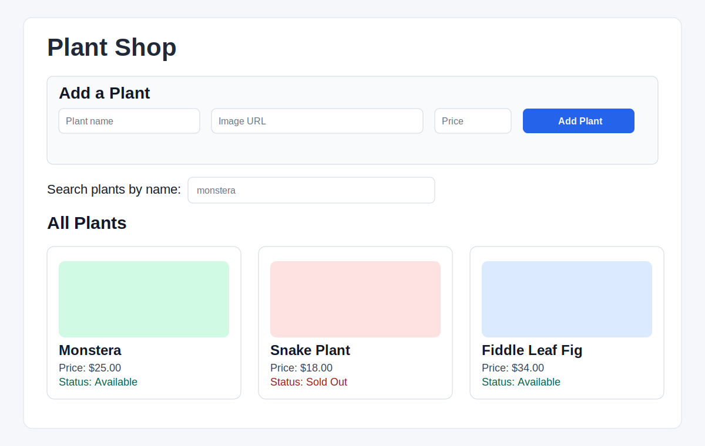

# Plant Shop (React + Vite)

## Description

Plant Shop is a React frontend connected to a REST backend for managing a simple plant inventory.

## Features

- Fetch and display all plants on initial page load.
- Add a new plant via form submission.
- Mark a plant as sold out in the UI (non-persisting toggle).
- Search plants by name with live filtering.

## Screenshot



## Tech Stack

- React 18
- Vite
- Fetch API
- Jest + React Testing Library

## Getting Started

1. Install dependencies:

   ```bash
   npm install
   ```

2. Start the backend:

   ```bash
   npm run server
   ```

3. In a new terminal, start the frontend:

   ```bash
   npm run dev
   ```

4. Open the Vite URL shown in terminal.

## API Contract

The UI expects:

- `GET http://localhost:6001/plants`
- `POST http://localhost:6001/plants`

## Project Structure

- `src/components/PlantPage.jsx` — data fetching, create flow, search filtering
- `src/components/NewPlantForm.jsx` — controlled form + submit handling
- `src/components/PlantList.jsx` — maps filtered plants to cards
- `src/components/PlantCard.jsx` — card UI + sold-out toggle button
- `src/components/Search.jsx` — controlled search input

## Testing

```bash
npm test
```

## Contributing

1. Create a branch from `main`.
2. Make focused changes with clear commit messages.
3. Push your branch and open a pull request.

## Project Status

Active learning project for React hooks + backend integration.

## Branch Cleanup (GitHub)

Delete merged remote branches:

```bash
git fetch --prune
git branch -r --merged origin/main | grep -v "origin/main" | sed 's/origin\///' | xargs -r -n 1 git push origin --delete
```

Delete fully merged local branches:

```bash
git branch --merged | grep -v "^*" | grep -v " main$" | xargs -r git branch -d
```

## License

See [LICENSE.md](LICENSE.md).